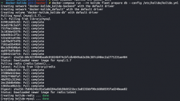
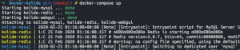

# Kolide Docker

This project contains code to spin up Kolide Fleet with Docker

## Generate OpenSSL keys
This project contains with a self-signed OpenSSL ceretificate which should ONLY BE used for testing. Below are instructions to make your own
1. `openssl req -x509 -nodes -days 365 -newkey rsa:2048 -keyout conf/tls/<name>.key -out conf/tls/<name>.crt`

## Set Kolide JWT key
This project has a pre-defined JWT key of `super_secret_key_here` which should ONLY BE used for testing. Below are instructions to make your own
1. `openssl rand -base64 32`
1. Copy key and paste in `conf/kolide/kolide.yml` as the value for `jwt_key`

## Dev/testing setup
1. `docker-compose build`
1. `docker-compose run --rm kolide fleet prepare db --config /etc/kolide/kolide.yml`
    1. Initializes Kolid database
    1. 
1. `docker-compose up -d`
    1. 

## References
* [Self-hosting Sentry With Docker and Docker-compose](https://mikedombrowski.com/2018/03/self-hosting-sentry-with-docker-and-docker-compose/)
* [Kolide - Configuring The Fleet Binary](https://github.com/kolide/fleet/blob/master/docs/infrastructure/configuring-the-fleet-binary.md)
* [DockerHub - MySQL](https://hub.docker.com/_/mysql?tab=description)
* [DockerHub - Kolide](https://hub.docker.com/r/kolide/fleet)
* [NGINX as a WebSocket Proxy](https://www.nginx.com/blog/websocket-nginx/)
* [DockerHub - NGINX](https://hub.docker.com/_/nginx?tab=tags)
